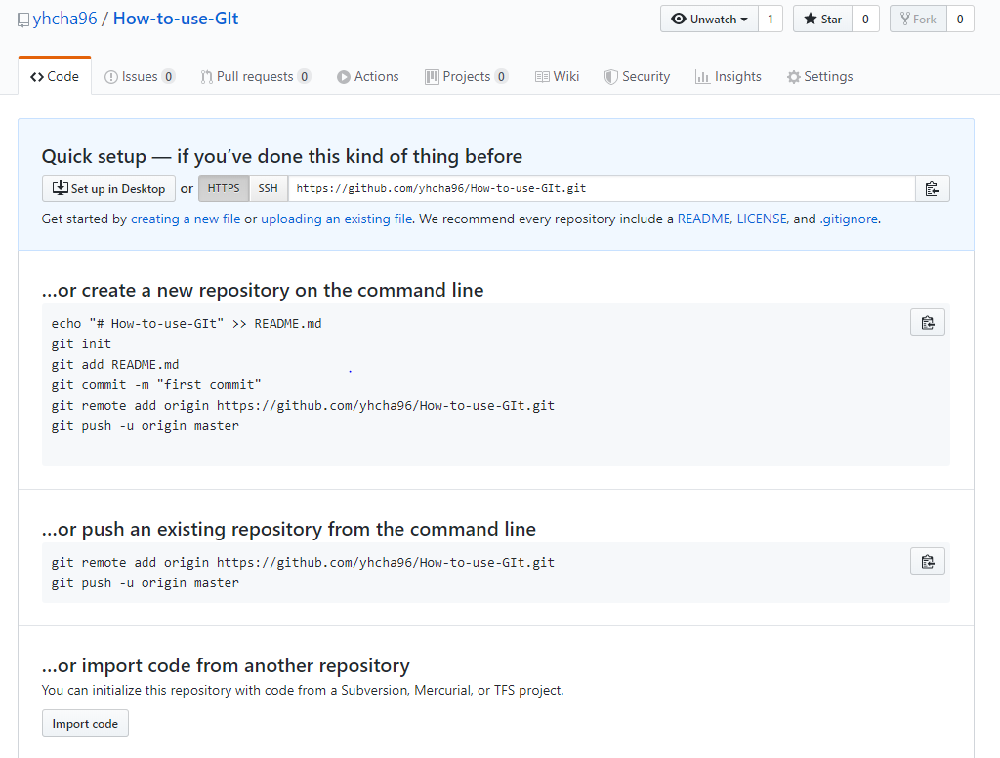

## Git 사전 준비

> git 을 사용하기 전에 커밋을 남기는 사람에 대한 정보를 설정한다.

```bash
$ git config --global user.name '{username}'
$ git config --global user.name '{email}'
```

- 추후에 commit을 작성한 사람(author)로 저장된다.

- email 정보는 github에서 활용하고 있는 email과 동일하게 설정하는 것을 추천한다.

- 설정 내용을 확인하려면 아래의 명령어를 입력한다.

  ```bash
  $ git config --global user.name
  $ git config --global user.email
  
  # 전체
  $ git config --global --list
  ```

## Git 기초

### 1.  저장소 설정

```bash
$ git init
Initialized empty Git repository in C:/Users/student/Desktop/Git/.git/
```

- git 저장소를 만들게 되면 해당 디렉토리 내에 `.git/`  폴더가 생성된다
- `git bash` 에서는 `(master)` 라는 표가가 같이 등장한다
  - 현재 작업 중인 브랜치를 의미한다


### 2. `add`

```bash
$ git status
On branch master

No commits yet
# 트래킹 되고 있지 않은 파일들
# => git으로 버전을 남긴적이 없는 파일
Untracked files:
  # staging area에 포함시키려면, git add
  # (커밋될 파일 목록)
  (use "git add <file>..." to include in what will be committed)
        Git_practice.md
# 커밋할 내용 없지만, 트래킹 되지 않는 파일은 존재한다
# => Working Directory에 있지만 Staging Area에는 없다
nothing to commit (create/copy files and use "git add" to track)

```

- Staging area에 추가

```bash
$ git add a.txt # a.txt라는 파일
$ git add myfolder/ # myfolder라는 폴더 전체
$ git add . # 현재 디렉토리 전체
```

- 추가 후 상태

  ```bash
  $ git status
  On branch master
  
  No commits yet
  # 커밋될 변경사항들 (staging area)
  Changes to be committed:
    (use "git rm --cached <file>..." to unstage)
         # Git_프로젝트_관리.md 새로 생성됨
          new file:   Git_프로젝트_관리.md
  ```


### 3. `commit`

> 커밋 메시지는 현재 버전에 대해 명확하게 작성

```bash
$ git commit -m 'Git에서 프로젝트 관리방법'
[master (root-commit) b11f2ea] Git에서 프로젝트 관리방법
 1 file changed, 30 insertions(+)
 create mode 100644 "Git_프로젝트_관리.md"
```

- 커밋 이력을 확인하기 위해서는 아래의 명령어를 입력한다

  ```bash
  $ git log # 기본
  commit b11f2ea98c2e2dff6ffe12f46712d277379b6078 (HEAD -> master)
  Author: yhcha96 <yhcha.h@gmail.com>
  Date:   Fri Apr 10 16:08:19 2020 +0900
  
      Git에서 프로젝트 관리방법
  
  $ git log -1 # 최근 한 개 커밋
  $ git log --oneline # 간단한 로그
  $ git log --oneline -1 # 최근 한 개의 커밋 간략하게
  ```

### 4. Git 상태 메시지

```bash
$ git status
# branch 정보
On branch master
Your branch is up to date with 'origin/master'.

# 커밋될 변경사항
# Staging area
Changes to be committed:
  # unstage => add를 취소하는 명령어(staging area -> WD)
  (use "git restore --staged <file>..." to unstage)
        modified:   cli.txt

# stage 상태가 아닌 변경사항
# Working directory
Changes not staged for commit:
  # WD => staging area
  (use "git add <file>..." to update what will be committed)
  # WD 작업 내용을 모두 삭제(되돌릴 수 없음.)
  (use "git restore <file>..." to discard changes in working directory)
        modified:   a.txt
```


## Git 원격저장소 활용(Github)

### 0. 원격저장소 설정

- Github에 repository를 생성한다.

  이 화면에서 명령문을 복사해서 사용하여 원격저장소 설정하면 됨

  

* 원격저장소 설정

  ```bash
  $ git remote add origin {__url__}
  ```

  - 원격저장소(`remote`)로 origin 이름으로 `url`을 추가(add)
  - 굳이 `origin`이라는 이름을 바꿀 필요가 없음

* 원격저장소 목록

  ```bash
  $ git remote -v
  origin  https://github.com/yhcha96/How-to-use-GIt.git (fetch)
  origin  https://github.com/yhcha96/How-to-use-GIt.git (push)
  ```

* 원격저장소 삭제

  ```bash
  $ git remote rm origin
  ```

  - `origin` 이름의 원격 저장소 설정을 삭제(remove - `rm`)


### 1. `push`

```bash
$ git push origin master
```

- 현재 폴더를 그대로 업로드 하는 것이 아니라, 지금까지의 이력/버전(commit)을 `push`하는 것이다.
- Working directory, Staging area의 변경사항들은 원격저장소로 `push`되지 않는다.
- 따라서, `push`전에 `$ git status`, `$ git log`를 통해서 확인하는 습관을 가지자.


### 2. `pull`

```bash
$ git pull origin master
```

- 원격저장소 변경 사항(이력)을 받아온다


### 다른 컴퓨터에서 접근하는 방법

- 컴퓨터에 해당 git저장소가 업는 경우 `clone`을 통해 원하는 git저장소를 받는다

  ```bash
  $ git clone {__url__}
  ```

  - `clone`은 **처음 한 번**만 해주면 된다

- `{__url__}`에 원하는 폴더의 url 주소를 넣으면 된다

  - url 주소는 초록색으로 되어 있는 **Clone or download** 에서 가져올 수 있다

#### 시나리오

1. 학교( 컴퓨터 A )

   1. commit

      - 수업 종료 후 commit

        ```bash
        $ git commit -m '4/10 - 케라스 활용방법'
        ```

   2. `push`

      ```bash
      $ git push origin master
      ```

2. 집( 컴퓨터 B )

   1. `pull`	

      ```bash
      $ git pull origin master
      ```

   2. 복습

   3. `commit`

      ```bash
      $ git commit -m '4/10 - keras 복습(블로그 정리)'
      ```

   4. `push`

      ```bash
      $ git push origin master
      ```

3. 학교( 컴퓨터 A )

   ```bash
   $ git pull origin master
   ```


#### 원격 저장소 활용시 주의사항

- 원격 저장소와 로컬 저장소의 이력이 다른 경우 아래와 같이 나타난다.
  - 예) `pull`을 하지 않고, 집에서 `commit` 하고 `push` 하는 경우

```bash
$ git push origin master
To https://github.com/edutak/git.git
 ! [rejected]        master -> master (fetch first)
error: failed to push some refs to 'https://github.com/edutak/git.git'
hint: Updates were rejected because the remote contains work that you do
hint: not have locally. This is usually caused by another repository pushing
hint: to the same ref. 
# 너는 아마도 원할 걸..? 
# 원격저장소(remote) 변화들(changes) 통합
# push를 다시 하기전에...
You may want to first integrate the remote changes
hint: (e.g., 'git pull ...') before pushing again.
hint: See the 'Note about fast-forwards' in 'git push --help' for details.
```


# 